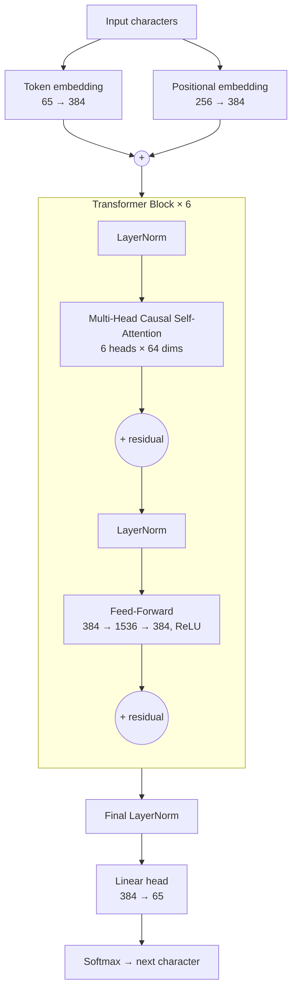

# GPT from Scratch

A character-level, decoder-only Transformer written in plain PyTorch. It learns to write Shakespeare, one character at a time.

The project follows the path from the simplest possible language model (a bigram lookup table) to a 10.8M-parameter GPT with multi-head self-attention, residual connections, LayerNorm and dropout, as described in [*Attention Is All You Need*](https://arxiv.org/abs/1706.03762) (Vaswani et al., 2017).

No `nn.Transformer`, no Hugging Face: every attention head, mask and projection is written by hand.
---

## Highlights

- **Self-attention from first principles.** The notebook derives causal attention step by step: a for-loop average, then matrix multiplication with a lower-triangular mask, then softmax weighting, then learned query/key/value projections.
- **Incremental build.** `bigram.py` → `bigram_v2.py` → `gpt.py`. Each step adds one idea, so you can see what each one contributes.
- **Full GPT architecture.** Token and positional embeddings, stacked pre-norm Transformer blocks, multi-head causal self-attention, a position-wise feed-forward network and a final language-model head.
- **Runs on a laptop.** Trains on a single consumer GPU (tested on an RTX 4050 Laptop with 6 GB VRAM).

---

## Architecture



Each attention head computes

$$\text{Attention}(Q, K, V) = \text{softmax}\left(\frac{QK^\top}{\sqrt{d_k}} + M\right)V$$

where $M$ is a causal mask (with $-\infty$ above the diagonal), so every position can only attend to earlier characters.

---

## Model configuration

| Hyperparameter | Value |
|---|---|
| Parameters | **10.8M** |
| Context length (`block_size`) | 256 characters |
| Embedding dim (`n_embd`) | 384 |
| Attention heads (`n_head`) | 6 |
| Transformer layers (`n_layer`) | 6 |
| Dropout | 0.2 |
| Batch size | 64 |
| Optimizer | AdamW, lr = 3e-4 |
| Training iterations | 5,000 |
| Vocabulary | 65 characters |

---

## Project structure

```
.
├── get-data.ipynb      # Walkthrough: data prep, tokenization, bigram model, attention derivation
├── bigram.py           # Baseline: bigram lookup-table language model
├── bigram_v2.py        # Bigram with embeddings, positional encoding and a linear head
├── gpt.py              # Full GPT: multi-head self-attention Transformer
└── data/
    └── input.txt       # Tiny Shakespeare dataset (~1.1M characters)
```

---

## Dataset

[Tiny Shakespeare](https://raw.githubusercontent.com/karpathy/char-rnn/master/data/tinyshakespeare/input.txt) is about 1.1M characters of Shakespeare's plays. Tokenization is character-level (65 unique symbols). The first 90% is used for training and the last 10% for validation.

---

## Quick start

```bash
# 1. Create an environment
conda create -n gpt-env python=3.10 -y
conda activate gpt-env
pip install torch numpy

# 2. Get the data (already included as data/input.txt)
wget -P data https://raw.githubusercontent.com/karpathy/char-rnn/master/data/tinyshakespeare/input.txt

# 3. Train and sample
python bigram.py      # baseline, runs in seconds
python gpt.py         # full model, needs a GPU
```

`gpt.py` picks up CUDA automatically when it is available. On CPU, training takes several hours.

---

## Results

| Model | Params | Val loss |
|---|---|---|
| Bigram (`bigram.py`) | ~4K | _TBD_ |
| GPT (`gpt.py`) | 10.8M | _TBD_ |

**Sample output** (500 characters generated from an empty context):

```
<paste generated text here after training>
```

---

## What I learned

- Why attention is a data-dependent **weighted average**, and how a lower-triangular mask with softmax turns it into a causal model.
- Why the $1/\sqrt{d_k}$ scaling matters: without it, softmax saturates and gradients vanish.
- How **residual connections** and **pre-LayerNorm** make deep stacks trainable.
- Practical GPU concerns: memory limits, the CUDA driver vs. PyTorch build mismatch, and the speed difference between CPU and GPU training.

---

## Roadmap

- [ ] Replace the per-head loop with a fused, batched attention (`F.scaled_dot_product_attention`)
- [ ] Byte-pair encoding (BPE) tokenizer instead of characters
- [ ] Save and load checkpoints, plus a separate `sample.py`
- [ ] Loss curves with TensorBoard or Weights & Biases
- [ ] Mixed-precision (`torch.autocast`) training

---

## Acknowledgements

- Vaswani et al., [*Attention Is All You Need*](https://arxiv.org/abs/1706.03762), NeurIPS 2017
- Andrej Karpathy, [*Let's build GPT: from scratch, in code, spelled out*](https://www.youtube.com/watch?v=kCc8FmEb1nY), which this project follows
- Tiny Shakespeare dataset from [char-rnn](https://github.com/karpathy/char-rnn)
